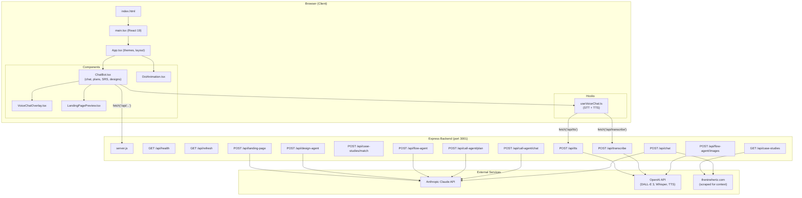
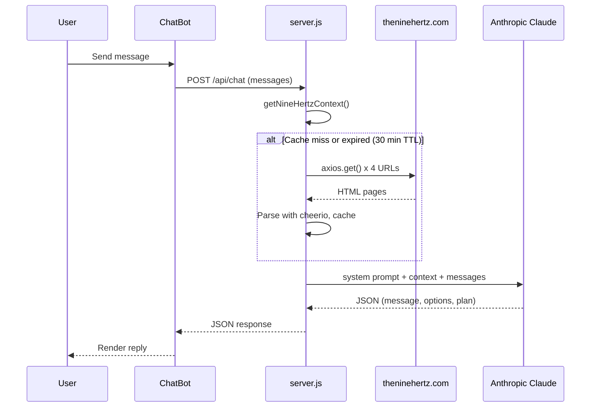

# NhzAI — Architecture & Documentation

## Project Overview

NhzAI is an AI-powered project discovery and planning tool for **NineHertz** (`theninehertz.com`). It provides:

- **Hz (Guided Chat)** — Conversational project discovery that generates tailored roadmaps
- **Alex (Voice Call Agent)** — SRS discovery calls via speech-to-text / text-to-speech
- **SRS Document Generator** — Full software requirements specification from call transcripts
- **Design Concept Generator** — AI-generated UI/UX mockup images via DALL-E 3
- **Landing Page Generator** — Complete self-contained HTML landing pages
- **Case Study Matching** — Matches client ideas to relevant NineHertz case studies

---

## Folder Structure

```
NhzAI/
├── index.html                    # Entry HTML — mounts React app into #root
├── server.js                     # Express backend — all API routes & AI integrations
├── package.json                  # Dependencies and npm scripts
├── .env                          # API keys (ANTHROPIC_API_KEY, OPENAI_API_KEY, PORT)
├── .env.example                  # Template for environment variables
├── .gitignore                    # Git ignore rules
├── ARCHITECTURE.md               # This file
│
├── vite.config.ts                # Vite build config with API proxy to :3001
├── tsconfig.json                 # TypeScript base config
├── tsconfig.app.json             # TypeScript config for src/
├── tsconfig.node.json            # TypeScript config for Node tooling
├── tailwind.config.js            # Tailwind CSS configuration
├── postcss.config.js             # PostCSS plugins (Tailwind + Autoprefixer)
├── eslint.config.js              # ESLint flat config
│
└── src/                          # Frontend source (React + TypeScript)
    ├── main.tsx                  # React 19 createRoot entry point
    ├── index.css                 # Global styles + Tailwind directives
    ├── App.tsx                   # Root component — themes, layout, header/footer
    │
    ├── components/
    │   ├── ChatBot.tsx           # Main chat UI — discovery, plans, SRS, designs, voice
    │   ├── DotAnimation.tsx      # Floating dot background animation
    │   ├── VoiceChatOverlay.tsx  # Full-screen voice call overlay UI
    │   └── LandingPagePreview.tsx # Iframe preview for generated landing pages
    │
    └── hooks/
        └── useVoiceChat.ts       # Voice chat hook — STT (browser + Whisper), TTS (OpenAI + browser)
```

---

## Architecture Diagram



---

## Data Flow (Chat Path)



---

## API Routes

| Method | Endpoint | Purpose |
|--------|----------|---------|
| `GET` | `/api/health` | Health check + cache status |
| `GET` | `/api/refresh` | Force re-scrape of NineHertz website |
| `POST` | `/api/chat` | Main guided discovery chat (Claude) |
| `GET` | `/api/case-studies` | List scraped case studies |
| `POST` | `/api/case-studies/match` | AI-match case studies to client idea |
| `POST` | `/api/flow-agent` | Generate FRD + design concepts (Claude) |
| `POST` | `/api/flow-agent/images` | Generate UI mockup images (DALL-E 3) |
| `POST` | `/api/call-agent/chat` | Voice call agent conversation (Claude) |
| `POST` | `/api/call-agent/plan` | Generate SRS from call transcript (Claude) |
| `POST` | `/api/design-agent` | Generate UI page specs from SRS (Claude) |
| `POST` | `/api/landing-page` | Generate full HTML landing page (Claude) |
| `POST` | `/api/transcribe` | Speech-to-text (OpenAI Whisper) |
| `POST` | `/api/tts` | Text-to-speech (OpenAI TTS) |

---

## Third-Party Dependencies

### Production Dependencies

| Package | Purpose |
|---------|---------|
| **`@anthropic-ai/sdk`** | Anthropic Claude API client — powers all chat, SRS generation, design concepts, and landing page generation |
| **`openai`** | OpenAI API client — DALL-E 3 image generation, Whisper speech-to-text, neural text-to-speech |
| **`express`** | HTTP server framework for all backend API routes |
| **`cors`** | Cross-origin resource sharing middleware for Express |
| **`axios`** | HTTP client used to scrape theninehertz.com for context data |
| **`cheerio`** | HTML parser — extracts headings and content from scraped web pages |
| **`dotenv`** | Loads `.env` file variables into `process.env` |
| **`concurrently`** | Runs frontend (Vite) and backend (Express) dev servers simultaneously |
| **`react`** | UI framework (v19) |
| **`react-dom`** | React DOM rendering |
| **`framer-motion`** | Animation library — page transitions, card animations, micro-interactions |
| **`lucide-react`** | Icon library — all UI icons (Send, Phone, Mic, etc.) |
| **`tailwindcss`** | Utility-first CSS framework |
| **`postcss`** | CSS processing pipeline |
| **`autoprefixer`** | Adds vendor prefixes to CSS |

### Dev Dependencies

| Package | Purpose |
|---------|---------|
| **`vite`** | Build tool and dev server with HMR |
| **`@vitejs/plugin-react`** | Vite plugin for React JSX/Fast Refresh |
| **`typescript`** | TypeScript compiler |
| **`typescript-eslint`** | TypeScript-aware ESLint rules |
| **`eslint`** | JavaScript/TypeScript linter |
| **`eslint-plugin-react-hooks`** | Enforces Rules of Hooks |
| **`eslint-plugin-react-refresh`** | Validates Fast Refresh compatibility |
| **`@eslint/js`** | ESLint core recommended rules |
| **`globals`** | Global identifier definitions for ESLint |
| **`@types/react`** | TypeScript types for React |
| **`@types/react-dom`** | TypeScript types for React DOM |
| **`@types/cors`** | TypeScript types for cors |
| **`@types/express`** | TypeScript types for Express |
| **`@types/node`** | TypeScript types for Node.js |

---

## Component Tree

```
App.tsx
├── ThemeBg (animated theme-specific background)
├── DotGrid (subtle dot grid overlay)
├── DotAnimation (floating particles)
├── NhzLogo (9Hz brand logo)
├── Header (logo, dark/light toggle, user avatar)
├── ChatBot.tsx (full-screen chat — the main application)
│   ├── Discovery questions with option chips
│   ├── ProjectPlanCard (roadmap visualization)
│   ├── CaseStudyCard (matched NineHertz case studies)
│   ├── SRSCard (full SRS document display)
│   │   ├── DesignPagesCard (AI-generated UI specs)
│   │   │   └── WireframeSection (miniature wireframe previews)
│   │   └── LandingPagePreview.tsx (iframe preview)
│   └── VoiceChatOverlay.tsx (voice call UI)
│       └── useVoiceChat.ts (STT/TTS hook)
└── Footer (links, social icons)
```

---

## Environment Variables

| Variable | Required | Description |
|----------|----------|-------------|
| `ANTHROPIC_API_KEY` | Yes | Anthropic API key for Claude (chat, SRS, designs, landing pages) |
| `OPENAI_API_KEY` | No | OpenAI API key for DALL-E 3 images, Whisper STT, neural TTS |
| `PORT` | No | Backend server port (default: `3001`) |
| `CRAWL_MAX_PAGES` | No | Max pages to crawl (default: `2000`). Sitemap + link discovery; increase for very large sites. |

---

## Scraping & Cache Management

All web scraping happens **server-side only**. The frontend never contacts theninehertz.com directly.

### What Gets Scraped

| Cache | Source | Data |
|-------|--------|------|
| **Context** | All discovered pages (up to `CRAWL_MAX_PAGES`, default 2000) | **Sitemap first**: fetch `sitemap.xml` (or sitemap index) to get every URL the site declares; then **merge** with link-following from the homepage. Each page stored as a **chunk** `{ text, url, label }`. Headings + paragraphs per page. |
| **Case Studies** | `/case-studies` page | Structured array of `{ title, url, slug, imageUrl }` objects |

### Discovery (all pages)

1. **Sitemap** — The server tries common sitemap paths (`/sitemap.xml`, `/sitemap_index.xml`, etc.). If found, it parses all `<loc>` URLs (and follows sitemap indexes). This gives every page the site declares, so the bot can answer any question.
2. **Link-following** — The server also crawls from the homepage (BFS) and adds any internal links not already in the sitemap list.
3. **Merge & cap** — URLs are deduped by path; priority pages (homepage, case-studies, services, etc.) are ordered first. Total pages crawled is capped at `CRAWL_MAX_PAGES` (default 2000) so very large sites don’t run indefinitely.

### Hybrid Retrieval (core + retrieved chunks)

Context sent to the chat model is built in two parts so it works for small and very large sites (e.g. when selling the product to other sites):

1. **Core (always sent)** — Up to **5,000 characters** from **priority pages** only: homepage, case-studies, services, industries, about-us, contact-us. Gives the model stable identity, contact, and main offerings every time.
2. **Retrieved chunks (per message)** — The **last user message** is used to search all chunks by **keyword**. Top-matching chunks are added until **15,000 characters**. So "Where is your office?" pulls in contact/location chunks; "Do you build mobile apps?" pulls in services chunks.

**Constants** in `server.js`: `CORE_MAX_CHARS = 5000`, `RETRIEVED_MAX_CHARS = 15000`, `PRIORITY_PATHS`. Total context sent to the model is capped at 25,000 characters.

**Scaling** — For sites with many pages, you never send the full site: only a small core + chunks relevant to the current question.

### Three-Layer Caching Strategy

```
Request arrives
    │
    ├── 1. IN-MEMORY (instant) ── Is data cached and TTL < 30 min? → Return immediately
    │
    ├── 2. STALE-WHILE-REVALIDATE ── Is data cached but TTL expired?
    │       → Return stale data immediately
    │       → Trigger background refresh (non-blocking)
    │
    └── 3. COLD START ── No data at all?
            → Coalesce all concurrent requests into one fetch
            → Wait for scrape to complete
            → Persist to disk for next restart
```

**Request Coalescing** — If 10 requests arrive during a cache miss, only 1 scrape runs. All 10 share the same promise.

**Stale-While-Revalidate** — After TTL expires, the first request gets stale data instantly while a background refresh runs. No user ever waits for a scrape after the first cold start.

**File Persistence** — Scraped data is saved as **chunks** in `.cache/context.json` and case studies in `.cache/case-studies.json`. On server restart, the disk cache is loaded instantly so there's no need to re-scrape on every `npm run dev`.

### Cache Files

```
.cache/
├── context.json        # { chunks: [{ text, url, label }, ...], time }
└── case-studies.json   # { data: [{title, url, slug, imageUrl}...], time }
```

### Key Functions

| Function | Purpose |
|----------|---------|
| `discoverAllPages()` | Crawls from homepage; discovers internal links; returns list of pages to fetch (max 150). Priority pages ordered first. |
| `fetchPage(url, label)` | Scrapes a single URL via `axios.get()` + `cheerio` |
| `fetchAndCacheContext()` | Calls `discoverAllPages()`, fetches each page, stores as **chunks** in memory + disk |
| `getCachedChunks()` | Entry point — returns cached chunks (stale-while-revalidate, coalesced fetch) |
| `buildCore(chunks)` | Builds the small "core" string from priority pages only (up to CORE_MAX_CHARS) |
| `retrieveChunks(chunks, query, maxChars)` | Keyword search over chunks; returns top-matching chunk texts up to maxChars |
| `scrapeCaseStudies()` | Scrapes `/case-studies`, saves to memory + disk |
| `fetchCaseStudiesList()` | Entry point — same pattern as context |
| `refreshContextInBackground()` | Non-blocking background refresh (coalesced) |
| `refreshCaseStudiesInBackground()` | Non-blocking background refresh (coalesced) |
| `GET /api/refresh` | Force-clears chunks + case studies and re-scrapes everything |
| `GET /api/health` | Returns chunks count, total chars, core/retrieved limits, case studies |
